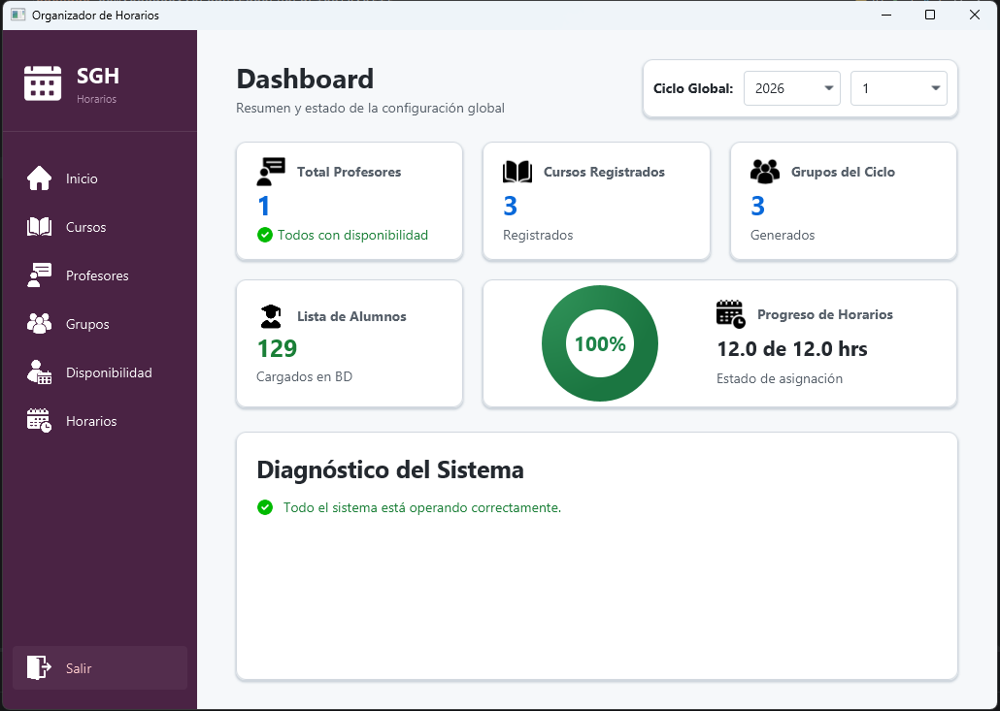
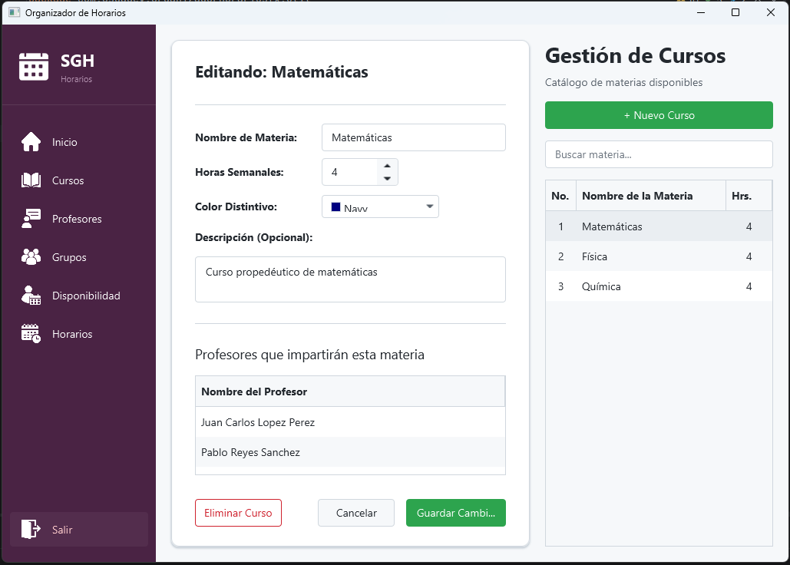
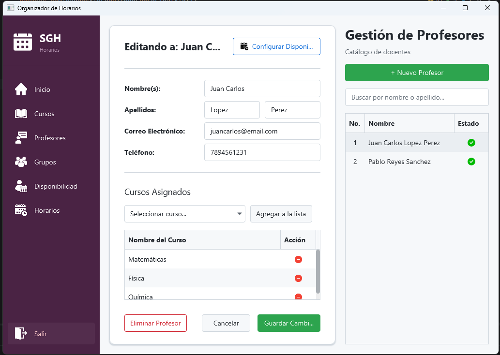
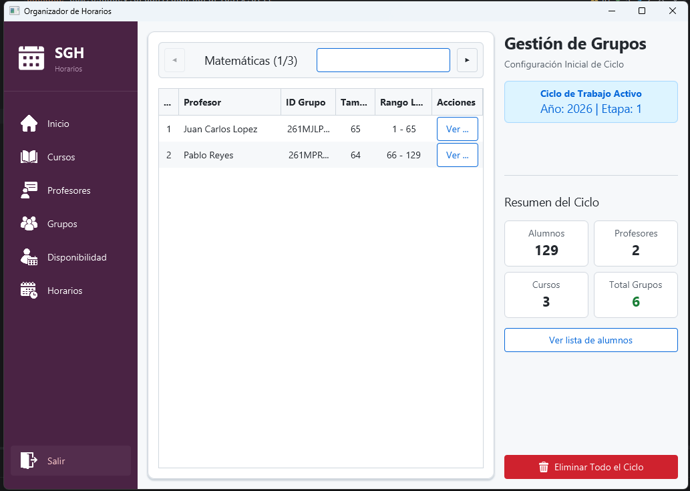
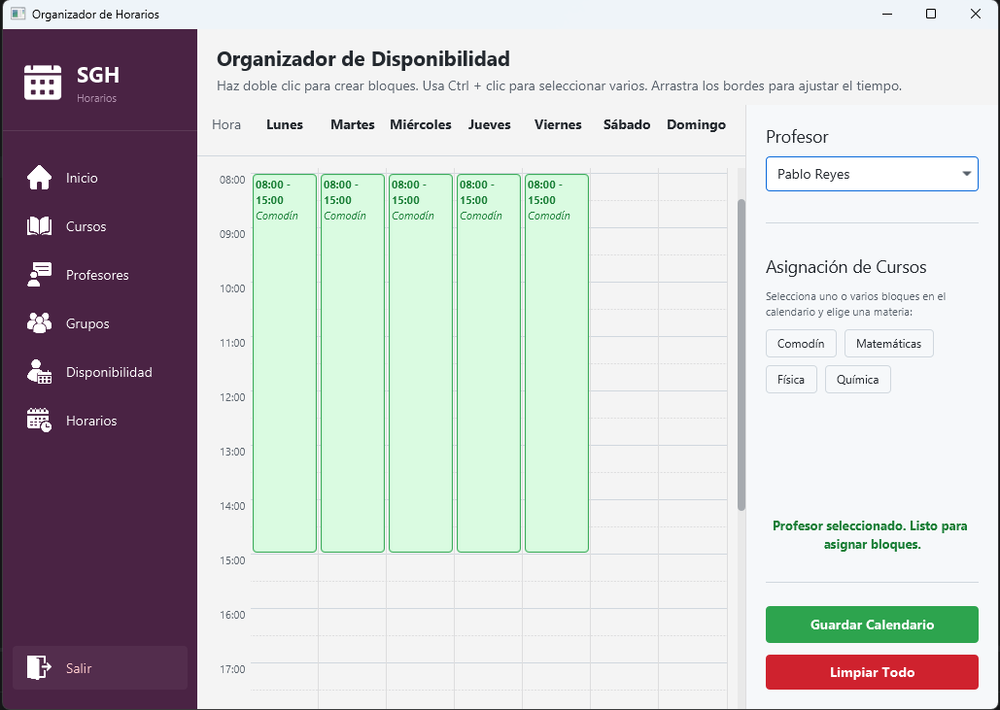
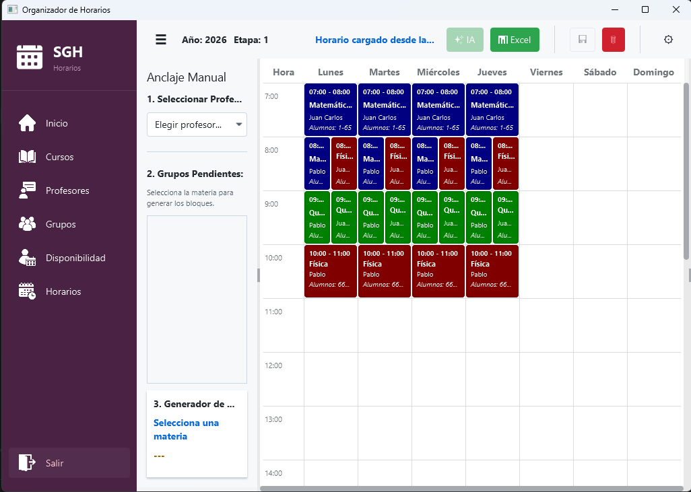

# Organizadorfx

Aplicacion para la creacion de grupos y horarios academicos para los cursos propedeuticos ofrecidos por la Universidad Autónoma Metropolitana Unidad Lerma

## Descripción
Esta aplicacion de escritorio permite a los coordinadores de los cursos propedeuticos facilitar la gestion de facilitadores,
cursos y alumnos de los cursos, asi como la generacion automatica de grupos y la creacion de horarios evitando traslapes.

## Características
- Gestion de la información y la disponibilidad de tiempo de los asesores
- Gestion cursos y su duracion
- Importacion de listas de estudio en formato xlsx para la generacion automatica de grupos
- Creacion de horarios con o sin lista de alumnos cargada
- Exportacion de horarios en formato xlsx
- Persistencia de datos en base de datos
- Interfaz grafica con JavaFX

## Tecnologias usadas

### Core

- Java 21
- Maven

### Interfaz gráfica
- JavaFX
- AtlantaFX

### Persistencia de datos

- MySQL
- SQLite (como base de datos embebida)

### Funcionalidades

- Choco Solver
- Apache POI

## Requisitos

- Java 21 o superior
- Intellij IDEA

La aplicacion utiliza SQLite embebido por defecto, por lo que no es necesario instalar una base de datos manualmente.

En el primer arranque, la aplicacion:

- crea automaticamente la base de datos local
- genera las tablas necesarias
- inicializa la estructura del sistema

El soporte para MySQL tambien esta disponible de forma opcional y puede habilitarse modificando la configuracion en la clase de conexión.

## Instalación

1. Clonar el repositorio con el comando
git clone \<repo-url\>

3. Abir el proyeto en Intellij IDEA

4. Esperar a que el IDE importe automaticamente las dependencias de Maven

6. Ejecutar la clase principal de la aplicacion
SchedulerApplication

## Estructura del proyecto
El proyecto sigue una arquitectura basada el el patrón MVC:
```text
organizador-horarios-fx
|   pom.xml
|   README.md
|
\---src
    \---main
        +---java
        |   |   module-info.java
        |   |
        |   \---com
        |       \---osgadev
        |           \---organizadorhorariosfx
        |               |   Launcher.java
        |               |   SchedulerApplication.java
        |               |
        |               +---controller
        |               +---dao
        |               +---dto
        |               +---model
        |               +---service
        |               +---util
        |               \---view
        |
        \---resources
            +---fxml
            +---css
            +---db
            \---images
```

## Funcionalidades

### Inicio

El panel de inicio proporciona una vista general del estado del sistema.

Desde esta sección es posible visualizar:

- Número total de asesores registrados
- Número total de cursos cargados
- Cantidad de grupos generados
- Estado de carga de la lista de alumnos
- Progreso de la creación de horarios mediante un gráfico de dona
- Mensajes de diagnóstico e información relevante del sistema

<p align="center">
  
</p>

---

### Cursos

Permite gestionar la información de los cursos.

Para cada curso se puede configurar:

- Nombre del curso
- Color identificador
- Número de horas semanales requeridas

Esto facilita la identificación visual de las sesiones dentro del horario.

<p align="center">
  
</p>

---

### Profesores

Permite administrar la información de los asesores y los cursos en los que cada uno puede impartir asesorías.

Desde esta sección se puede:

- Registrar asesores
- Editar su información
- Eliminar registros
- Asignar cursos a cada asesor

Esta información es utilizada posteriormente en la generación de horarios.

<p align="center">
  
</p>

---

### Grupos

Permite generar automáticamente grupos de alumnos.

Los grupos pueden crearse de dos formas:

- A partir de un número total de alumnos
- A partir de una lista de alumnos cargada previamente

En ambos casos, el sistema utiliza el total de alumnos para generarlos automáticamente.

Además, esta sección permite:

- Visualizar la información de cada grupo
- Consultar la lista completa de grupos
- Eliminar el ciclo completo

<p align="center">
  
</p>

---

### Disponibilidad

Permite gestionar visualmente los bloques de tiempo disponibles de cada asesor.

La interfaz funciona mediante bloques interactivos que pueden:

- Crearse
- Arrastrarse
- Modificarse
- Eliminarse

Esta funcionalidad permite definir con precisión cuándo cada asesor está disponible para impartir asesorías.

<p align="center">
  
</p>

---

### Horarios

Permite crear y administrar horarios de asesorías.

La creación manual se realiza mediante una mecánica de **drag & drop**, donde los bloques de sesión pueden colocarse únicamente cuando:

- El horario está disponible
- No existen traslapes con otras sesiones

La aplicación también incluye una funcionalidad de **generación automática de horarios**, actualmente en desarrollo, por lo que algunos escenarios aún pueden presentar comportamientos no esperados.

Adicionalmente, esta sección incluye filtros avanzados para visualizar información por:

- Asesor
- Curso

También incorpora opciones de visualización mediante checkboxes para mostrar información adicional en cada tarjeta de sesión, como:

- Rango de estudiantes asignados
- Nombre del asesor
- ID del grupo
- Nombre del grupo

Finalmente, los horarios generados pueden exportarse para su uso externo.

<p align="center">
  
</p>

## Mejoras Futuras

Actualmente, la aplicación está enfocada principalmente en la fase de **preparación de cursos**, es decir, en la organización inicial previa al inicio de las asesorías.

Entre las mejoras planeadas para futuras versiones se encuentran:

- **Gestión dinámica de grupos en curso**  
  Implementar soporte para administrar cambios una vez iniciadas las asesorías, incluyendo:
  - Altas de alumnos
  - Bajas de alumnos
  - Cambios de grupo

- **Mejoras en la creación manual de horarios**  
  Optimizar la experiencia de edición manual para hacer más intuitiva y flexible la asignación de sesiones.
  Implementar logica que permita mas flexibilidad a la hora de crear horarios.

- **Funcionalidad de lista extra**  
  Incorporar soporte para cargar listas adicionales de alumnos después de la generación inicial de grupos.

  Esta funcionalidad permitiría repartir automáticamente nuevos alumnos entre los grupos existentes.

---

## Autor

Desarrollado por **Isaac Osoños Garrido**
Java Developer

- GitHub: [@osgadev](https://github.com/osgadev)
- LinkedIn: [Isaac Osoños Garrido](https://www.linkedin.com/in/isaacosonos/)
